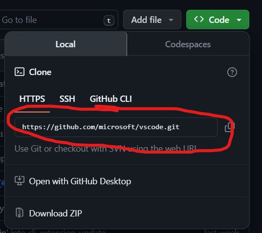
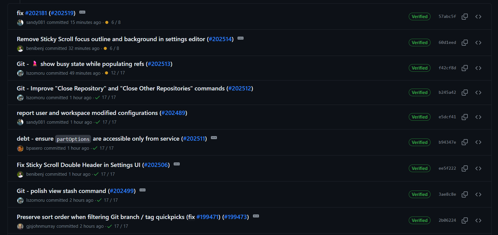

# TP 1 Exercice 

- **Tâche 1 :** Cloner le dépôt de Visual Studio Code : 

Pour clôner un dépot nous allons : 

1. Dans GitHub.com, accédez à la page principale du dépôt.

2. Au-dessus de la liste des fichiers, cliquez sur  Code.

3. Copiez l'URL du dépôt



4. Ouvrir GitBash

5. Tapez git clone, puis collez l’URL que l'on a précédemment copié. 

```sh
 git clone https://github.com/microsoft/vscode.git

``` 


- **Tâche 2 :** Examiner l'historique des commits et identifier les types de modifications (features, bug fixes).

Voici la liste des derniers commits : 




- **Tâche 3 :** Créer une nouvelle branche, faire de petites modifications (par exemple, dans le fichier README), et committer ces changements.

Pour créer une nouvelle branche : 

```sh
git branch testBranch
```
Basculer sur une autre branche 

```sh
git checkout testBranch
```

On fait maintenant des petites modifications dans le Readme : 

```sh
nano readme.md
```

on met ensuite à jour les modifications afin de préparer le contenu pour la prochaine validation 
```sh
git add . 
```
Puis on commit les changements via la commande suivante :

```sh
git commit -m "nolog: changement readme.md"

```
