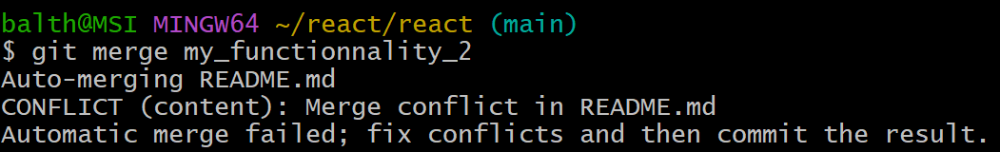
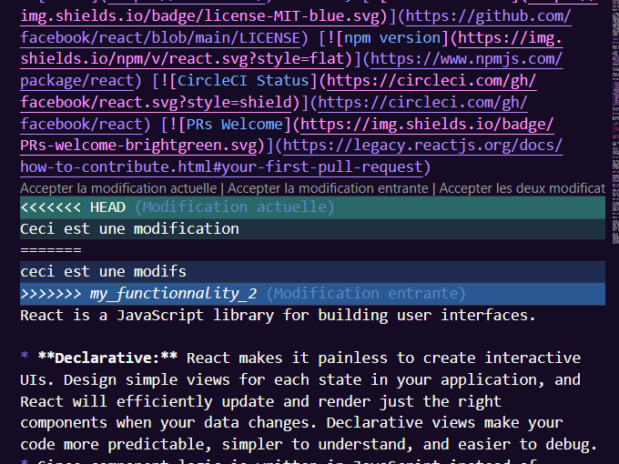

### TP 3: Utilisation Avancée de Git

- **Tâche 1 :** Créer des branches pour des fonctionnalités hypothétiques, fusionner ces branches.

Pour créer des branches et les fusionner, suivez ces étapes : 

1. Cloner le dépot : 

```sh
git clone git@github.com:facebook/react.git
cd react 
```
2. Créer une nouvelle branche pour une fonctionnalité :


```sh
git checkout -b my_functionnality_1
 
```
3. Ensuite effectuer des modifications dans la nouvelle branche. 

4. Ajoutez et valider les modifications :

```sh
git add . 
git commit -m 'added functionality' 
```
5. Revenir à la branche principale : 
```sh
git checkout main 
```
6. Fusionner la branche dans la branche principale:
 
 ```sh
 git merge my_functionnality_1
 ```


- **Tâche 2 :** Simuler un conflit de merge et le résoudre.

1. Effectuer des modifications dans la branche que l'on a créé précédemment. 

2. Ajouter et valider les modifications. 

```sh
git add . 
git commit -m "Modifications to the my_functionnality_1 branch " 
```
3. Revenir à la branche princpale 
```sh
git checkout main 
```
4. Créer une autre branche et modifier le même fichier :
```sh
git checkout -b my_functionnality_2
```
Apportez des modifications au même fichier que dans la branche 'my_functionnality_1"
5. Ajouter et valider les modifications 

6. Fusionner les branches dans la branche principale(simulera un conflit )

```sh
git merge my_functionnality_1 
```


7. Ouvrez le fichier dans un éditeur de texte. Les sections en conflit seront entourées de balies '<<<<<<<, =======, et >>>>>>>'.
Modifier le fichier pour résoudre les conflits, puis sauvegardez.



8. Ajoutez les modifications résolues :
```sh
git add . 
```

9. Finaliser la fusion :
```sh
git merge --continue
```

10. Pousser les modifications vers le dépôt distant : 

```sh
git push origin main
```